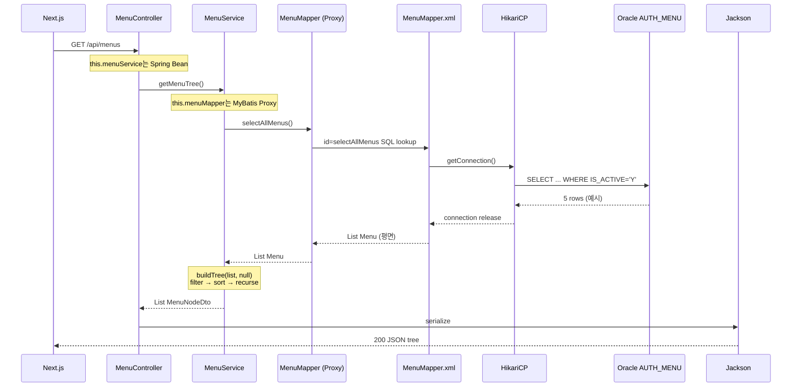

# DB 데이터 흐름 (API → DB → 응답) — 상세版

프론트엔드에서 `GET /api/menus` 한 번 호출했을 때, **어떤 객체가 왜 등장하고**, **각 줄에서 무슨 비즈니스 판단이 일어나는지** 코드 기준으로 아주 세세하게 설명합니다.

---

## 0. 이 API가 해결하는 업무 문제

병원 HIS 프론트(Next.js)는 **사이드바·상단 네비게이션에 표시할 메뉴 목록**이 필요합니다.

- 메뉴 데이터는 Oracle `HOSPITAL.AUTH_MENU` 테이블에 저장되어 있음
- DB에는 메뉴가 **한 줄(한 행)씩 평면**으로 저장됨 (`PARENT_ID`로 부모만 가리킴)
- 프론트는 **중첩 JSON 트리** (`children` 배열) 형태가 렌더링하기 쉬움

그래서 이 백엔드 API의 업무 역할은:

1. DB에서 **사용 중인 메뉴만** 읽어오고 (`IS_ACTIVE = 'Y'`)
2. **정렬 순서**를 지키면서 (`SORT_ORDER`)
3. **부모-자식 관계**를 트리로 재구성한 뒤
4. 프론트에 필요한 필드만 JSON으로 내려주는 것

---

## 1. 한눈에 보는 구조

```
Next.js (localhost:3000)
        │
        │  GET http://localhost:8081/api/menus
        ▼
┌──────────────────────────────────────────────────────────────┐
│  Spring Boot (:8081)                                         │
│                                                              │
│  MenuController  ──위임──▶  MenuService  ──호출──▶  MenuMapper │
│       ▲                          │                    │      │
│       │                          │                    ▼      │
│       │                          │              MenuMapper.xml │
│       │                          │                    │      │
│       │                          │                    ▼      │
│       │                          │             HikariCP 풀    │
│       │                          │                    │      │
│       │                          │                    ▼      │
│       │                          │              Oracle XE     │
│       │                          │           CMH.AUTH_MENU    │
│       │                          │                    │      │
│       │                          ◀── List<Menu> (평면)        │
│       │                          │                           │
│       │                          │  buildTree() + toDto()    │
│       │                          ▼                           │
│       ◀──── List<MenuNodeDto> ── Jackson JSON 직렬화           │
└──────────────────────────────────────────────────────────────┘
        │
        ▼
   프론트 사이드바 렌더링
```

---

## 2. 서버 기동 시: `menuMapper`는 왜, 어떻게 생기는가?

`MenuService` 안에 아래 코드가 있습니다.

```java
private final MenuMapper menuMapper;

public MenuService(MenuMapper menuMapper) {
    this.menuMapper = menuMapper;
}
```

### 2-1. `this.menuMapper`가 뭐냐?

| 항목 | 설명 |
|------|------|
| **타입** | `MenuMapper` (Java 인터페이스) |
| **실제 객체** | MyBatis가 런타임에 만들어 준 **프록시(Proxy) 구현체** |
| **역할** | `selectAllMenus()`를 호출하면 XML에 적힌 SQL을 Oracle에 실행 |
| **저장 위치** | `MenuService` 인스턴스의 필드 (`this.menuMapper`) |

`MenuMapper.java`에는 **메서드 선언만** 있고, SQL 본문은 없습니다.

```java
@Mapper
public interface MenuMapper {
    List<Menu> selectAllMenus();
}
```

실제 SQL은 `MenuMapper.xml`에 있습니다. MyBatis가 **인터페이스 메서드 ↔ XML의 `<select id="...">`** 를 연결합니다.

### 2-2. Spring이 `MenuService`에 `menuMapper`를 넣어 주는 이유 (의존성 주입)

Spring Boot 기동 순서를 단순화하면:

```
1. HospitalApplication.main() 실행
2. @SpringBootApplication → com.hospital 패키지 스캔
3. @MapperScan("com.hospital.menu") → MenuMapper 프록시 Bean 생성
4. @Service → MenuService Bean 생성
5. MenuService 생성자에 MenuMapper Bean을 넣어서 new MenuService(menuMapper)
6. @RestController → MenuController Bean 생성
7. MenuController 생성자에 MenuService Bean 주입
```

**왜 직접 `new MenuMapper()` 안 하고 주입받나?**

- DB 연결, 트랜잭션, SQL 매핑은 MyBatis/Spring이 관리해야 함
- `MenuService`는 "트리 만드는 로직"만 알면 되고, SQL 실행 디테일은 몰라도 됨 → **역할 분리**
- 테스트할 때 가짜 Mapper를 넣기 쉬움

그래서 `getMenuTree()` 안에서 `menuMapper.selectAllMenus()`가 나오는 것입니다.  
**"DB에서 메뉴 평면 목록 가져와"** 라는 일을 Mapper에게 위임하는 호출입니다.

### 2-3. `@MapperScan`이 없으면?

`MenuMapper`는 Spring Bean으로 등록되지 않고, `MenuService` 생성 시 **주입 실패로 앱이 안 켜집니다.**

```java
@MapperScan("com.hospital.menu")  // HospitalApplication.java
```

---

## 3. 요청 1건이 들어오면 — 레이어별 초상세

### 3-1. HTTP 요청 → `MenuController`

| 항목 | 값 |
|------|-----|
| 메서드 | `GET` |
| URL | `/api/menus` |
| 전체 주소 | `http://localhost:8081/api/menus` |
| CORS 허용 Origin | `http://localhost:3000`, `http://127.0.0.1:3000` |

프론트가 `fetch("http://localhost:8081/api/menus")`를 호출하면:

1. Tomcat(내장 웹서버)이 8081 포트에서 요청 수신
2. Spring MVC가 `@RequestMapping("/api/menus")` + `@GetMapping` 매칭
3. `MenuController.getMenus()` 실행

```java
@RestController
@RequestMapping("/api/menus")
public class MenuController {

    private final MenuService menuService;  // Spring이 주입해 둔 Bean

    public MenuController(MenuService menuService) {
        this.menuService = menuService;
    }

    @GetMapping
    public List<MenuNodeDto> getMenus() {
        return menuService.getMenuTree();   // ← 컨트롤러는 여기까지만
    }
}
```

**컨트롤러가 하지 않는 일 (의도적)**

- SQL 작성/실행
- `PARENT_ID`로 트리 만들기
- JSON 문자열 직접 작성

**컨트롤러가 하는 일**

- URL과 HTTP 메서드를 API로 노출
- `MenuService` 결과를 그대로 반환 → Spring이 JSON으로 변환

`this.menuService`가 나오는 이유도 `menuMapper`와 같습니다.  
Spring이 미리 만들어 둔 `MenuService` Bean을 생성자로 받아 필드에 저장해 둔 것입니다.

---

### 3-2. `MenuService.getMenuTree()` — 진입점

```java
public List<MenuNodeDto> getMenuTree() {
    return buildTree(menuMapper.selectAllMenus(), null);
}
```

이 한 줄은 사실 **두 단계**입니다.

| 순서 | 코드 | 의미 |
|------|------|------|
| ① | `menuMapper.selectAllMenus()` | Oracle에서 활성 메뉴 전체를 `List<Menu>`로 조회 |
| ② | `buildTree(..., null)` | 평면 리스트를 루트(`parentId == null`)부터 트리로 변환 |

`null`을 넘기는 이유: **"부모가 없는 최상위 메뉴부터 트리를 시작하라"**는 뜻입니다.

---

### 3-3. `menuMapper.selectAllMenus()` — DB 조회 내부

#### (1) Java에서 호출

```java
List<Menu> flatList = menuMapper.selectAllMenus();
```

#### (2) MyBatis가 XML 찾기

- namespace: `com.hospital.menu.MenuMapper`
- id: `selectAllMenus`
- → `MenuMapper.xml`의 `<select id="selectAllMenus">` 실행

#### (3) 실행되는 SQL

```sql
SELECT
    MENU_ID     AS id,
    PARENT_ID   AS parentId,
    CODE        AS code,
    NAME        AS name,
    PATH        AS path,
    ICON        AS icon,
    SORT_ORDER  AS sortOrder
FROM CMH.AUTH_MENU
WHERE IS_ACTIVE = 'Y'
ORDER BY SORT_ORDER
```

**WHERE `IS_ACTIVE = 'Y'`의 업무 의미**

- `'N'`인 메뉴 = 비활성/숨김 메뉴
- API는 **현재 화면에 쓸 메뉴만** 내려야 하므로 활성 행만 조회

**ORDER BY `SORT_ORDER`의 의미**

- DB 단계에서 1차 정렬
- 이후 `buildTree()`에서 형제 메뉴끼리 다시 `sortOrder`로 정렬 (이중 안전장치)

#### (4) JDBC + HikariCP

1. HikariCP 커넥션 풀에서 Oracle 연결 1개 대여
2. JDBC로 SQL 실행
3. ResultSet(행 목록) 수신
4. 각 행을 `Menu` 객체로 변환
5. 연결 반환

연결 설정 (`application.yml`):

```yaml
spring:
  datasource:
    url: jdbc:oracle:thin:@localhost:1521:XE
    username: hospital
    password: "1111"
```

#### (5) ResultSet → `Menu` 객체 매핑

XML에 `AS id`, `AS parentId` alias가 있고, `resultType="com.hospital.menu.Menu"`로 지정되어 있습니다.

```yaml
mybatis:
  configuration:
    map-underscore-to-camel-case: true
```

| DB 컬럼 (ResultSet) | alias | `Menu` 필드 |
|---------------------|-------|-------------|
| `MENU_ID` | `id` | `id` |
| `PARENT_ID` | `parentId` | `parentId` |
| `CODE` | `code` | `code` |
| `NAME` | `name` | `name` |
| `PATH` | `path` | `path` |
| `ICON` | `icon` | `icon` |
| `SORT_ORDER` | `sortOrder` | `sortOrder` |

`IS_ACTIVE`는 SELECT 목록에 없음 → Java 객체에 안 들어감 (조회 조건으로만 사용).

#### (6) 반환 결과 형태

```java
List<Menu>  // 예: 크기 5인 ArrayList, 각 원소가 Menu 한 행
```

**중요:** 아직 트리가 아닙니다. DB 그대로의 **평면 리스트**입니다.

---

### 3-4. `buildTree()` — 핵심 비즈니스 로직 (재귀)

```java
private List<MenuNodeDto> buildTree(List<Menu> flatList, Long parentId) {
    List<MenuNodeDto> result = new ArrayList<>();

    flatList.stream()
            .filter(menu -> Objects.equals(menu.getParentId(), parentId))
            .sorted(Comparator.comparing(
                    menu -> menu.getSortOrder() != null ? menu.getSortOrder() : 0))
            .forEach(menu -> {
                MenuNodeDto node = toDto(menu);
                node.setChildren(buildTree(flatList, menu.getId()));
                result.add(node);
            });

    return result;
}
```

#### 왜 DB에서 트리 JOIN/recursive SQL 안 하고 Java에서 하나?

현재 구현 선택:

- SQL은 **단순 SELECT 한 번** (유지보수 쉬움)
- 메뉴 개수는 보통 수십~수백 수준 → 메모리에서 트리 구성 비용 작음
- 프론트 응답 형태(`children` 중첩)에 맞추는 변환 로직을 **서비스 레이어**에 둠

#### 줄 단위 동작

**① `flatList.stream()`**  
DB에서 받은 전체 메뉴를 스트림으로 순회 준비.

**② `.filter(menu -> Objects.equals(menu.getParentId(), parentId))`**  
"지금 찾는 부모 ID와 `parentId`가 같은 메뉴만" 골라냄.

- `Objects.equals`를 쓰는 이유: `parentId`가 `null`(루트)일 때 NPE 방지
- 첫 호출 `buildTree(flatList, null)` → `PARENT_ID IS NULL`인 행 = 최상위 메뉴

**③ `.sorted(Comparator.comparing(...))`**  
형제 메뉴(같은 부모 아래)끼리 `sortOrder` 오름차순.

- `sortOrder`가 DB에서 `null`이면 `0`으로 취급 → 맨 앞쪽으로

**④ `.forEach(menu -> { ... })`**  
각 후보 메뉴에 대해:

1. `toDto(menu)` → API용 노드 생성
2. `buildTree(flatList, menu.getId())` → **자식 목록을 재귀 호출**로 구함
3. `node.setChildren(...)` → 자식 트리 연결
4. `result.add(node)` → 현재 레벨 결과에 추가

**⑤ `return result`**  
현재 `parentId` 아래의 형제 노드 리스트 반환.

---

### 3-5. 구체 예시 — DB 5행 → 트리 2개 루트

DB `CMH.AUTH_MENU` (활성 메뉴만):

| MENU_ID | PARENT_ID | CODE | NAME | PATH | SORT_ORDER |
|---------|-----------|------|------|------|------------|
| 1 | NULL | DASHBOARD | 대시보드 | /dashboard | 10 |
| 2 | NULL | PATIENT | 환자 관리 | /patients | 20 |
| 3 | 2 | PATIENT_LIST | 환자 목록 | /patients/list | 10 |
| 4 | 2 | PATIENT_REG | 환자 등록 | /patients/new | 20 |
| 5 | 1 | DASH_SUMMARY | 요약 | /dashboard/summary | 10 |

#### Step A — `selectAllMenus()` 결과 (`List<Menu>`)

5개 `Menu` 객체, 순서는 `SORT_ORDER` 기준(전역 정렬).

#### Step B — `buildTree(flatList, null)` (루트 찾기)

`parentId == null` 필터 → id **1**, **2**만 남음.

| id | name | sortOrder |
|----|------|-----------|
| 1 | 대시보드 | 10 |
| 2 | 환자 관리 | 20 |

#### Step C — id=1 "대시보드" 처리

- `toDto` → `{ id:1, code:"DASHBOARD", name:"대시보드", ... }`
- `buildTree(flatList, 1)` 호출 → parentId=1인 행: id **5**
- id=5 노드 생성, 자식 없음 → `children: []`
- 대시보드 노드의 children = `[ 요약 노드 ]`

#### Step D — id=2 "환자 관리" 처리

- `buildTree(flatList, 2)` → id **3**, **4**
- sortOrder 10, 20 순 → `[환자 목록, 환자 등록]`

#### Step E — 최종 API 구조

```json
[
  {
    "id": 1,
    "code": "DASHBOARD",
    "name": "대시보드",
    "path": "/dashboard",
    "icon": "...",
    "children": [
      {
        "id": 5,
        "code": "DASH_SUMMARY",
        "name": "요약",
        "path": "/dashboard/summary",
        "icon": "...",
        "children": []
      }
    ]
  },
  {
    "id": 2,
    "code": "PATIENT",
    "name": "환자 관리",
    "path": "/patients",
    "icon": "...",
    "children": [
      { "id": 3, "code": "PATIENT_LIST", "name": "환자 목록", ... },
      { "id": 4, "code": "PATIENT_REG", "name": "환자 등록", ... }
    ]
  }
]
```

프론트는 `children`만 보면서 재귀 렌더링하면 사이드바 완성.

---

### 3-6. `toDto()` — Entity → API DTO 변환

```java
private MenuNodeDto toDto(Menu menu) {
    MenuNodeDto dto = new MenuNodeDto();
    dto.setId(menu.getId());
    dto.setCode(menu.getCode());
    dto.setName(menu.getName());
    dto.setPath(menu.getPath());
    dto.setIcon(menu.getIcon());
    return dto;
}
```

| 구분 | `Menu` (Entity) | `MenuNodeDto` (API) |
|------|-----------------|---------------------|
| 용도 | DB 1행 매핑 | HTTP JSON 응답 |
| `parentId` | 있음 (트리 구성용) | **없음** (이미 트리 구조로 표현됨) |
| `sortOrder` | 있음 (정렬용) | **없음** (정렬 완료 후 불필요) |
| `children` | 없음 | **있음** (`buildTree`에서 채움) |

**왜 굳이 DTO를 쓰나?**

- DB 스키마 필드를 API에 그대로 노출하지 않음
- 나중에 DB 컬럼 추가/변경과 API 계약을 분리 가능
- 프론트에 필요 없는 내부 필드(`parentId`, `sortOrder`) 제거

---

### 3-7. Controller → HTTP 응답 (JSON)

`getMenus()`가 `List<MenuNodeDto>`를 return하면:

1. Spring MVC가 반환 타입 확인
2. **Jackson** (`spring-boot-starter-web` 포함)이 객체 → JSON 문자열 변환
3. HTTP 200, `Content-Type: application/json` 으로 응답

```http
HTTP/1.1 200 OK
Content-Type: application/json
Access-Control-Allow-Origin: http://localhost:3000

[ { "id": 1, "code": "DASHBOARD", ... } ]
```

컨트롤러/서비스는 JSON 문자열을 직접 만들지 않습니다.

---

## 4. DB 테이블 — `CMH.AUTH_MENU`

| DB 컬럼 | Java (`Menu`) | API (`MenuNodeDto`) | 설명 |
|---------|---------------|---------------------|------|
| `MENU_ID` | `id` | `id` | PK |
| `PARENT_ID` | `parentId` | *(미포함)* | 부모 ID. NULL = 루트 |
| `CODE` | `code` | `code` | 권한·식별 코드 |
| `NAME` | `name` | `name` | 화면 표시명 |
| `PATH` | `path` | `path` | Next.js 라우트 |
| `ICON` | `icon` | `icon` | 아이콘 키 |
| `SORT_ORDER` | `sortOrder` | *(미포함)* | 형제 간 순서 |
| `IS_ACTIVE` | *(조건)* | *(미포함)* | `'Y'`만 조회 |

확인 SQL: `sql/check-menu-table.sql`

---

## 5. 객체 등장 순서 요약 (한 요청 기준)

```
[HTTP Request]
    ↓
MenuController (menuService 주입됨)
    ↓ menuService.getMenuTree()
MenuService (menuMapper 주입됨)
    ↓ menuMapper.selectAllMenus()
MenuMapper 프록시 (MyBatis)
    ↓ XML SQL
HikariCP → Oracle AUTH_MENU
    ↓ ResultSet
List<Menu> flatList
    ↓ buildTree(flatList, null) 재귀
    ↓ toDto() 각 노드
List<MenuNodeDto>
    ↓ Jackson
[HTTP Response JSON]
```

---

## 6. 전체 시퀀스 다이어그램



---

## 7. 레이어별 책임 (왜 이렇게 나눴나)

| 레이어 | 클래스 | 책임 | DB/SQL 알고 있나? |
|--------|--------|------|-------------------|
| API | `MenuController` | URL, HTTP, CORS | ❌ |
| 비즈니스 | `MenuService` | 활성 메뉴 → 트리 변환, 정렬 규칙 | ❌ (Mapper에 위임) |
| persistence | `MenuMapper` + XML | SQL 실행, Row → `Menu` | ✅ |
| DB | `CMH.AUTH_MENU` | 데이터 저장 | — |

**`menuMapper`가 Service에 있는 이유 한 줄 요약:**  
Service는 "트리로 어떻게 보여줄지"를 알고, Mapper는 "DB에서 어떻게 가져올지"를 안다.

---

## 8. 관련 파일 맵

| 레이어 | 파일 | 역할 |
|--------|------|------|
| 진입점 | `HospitalApplication.java` | `@MapperScan`, Spring Boot 기동 |
| API | `MenuController.java` | `GET /api/menus` |
| CORS | `WebConfig.java` | `/api/**` cross-origin 허용 |
| 서비스 | `MenuService.java` | `getMenuTree`, `buildTree`, `toDto` |
| 매퍼 IF | `MenuMapper.java` | `selectAllMenus()` 선언 |
| SQL | `MenuMapper.xml` | `AUTH_MENU` SELECT |
| Entity | `Menu.java` | DB 1행 |
| DTO | `MenuNodeDto.java` | JSON 트리 노드 |
| 설정 | `application.yml` | datasource, mybatis |
| 점검 | `sql/check-menu-table.sql` | SQLGate 확인 |

---

## 9. 자주 나올 질문

### Q. `menuMapper`를 `MenuService`에서 `new`하면 안 되나?

안 됩니다. MyBatis 프록시 + DB 연결은 Spring/MyBatis 컨테이너가 만들어야 합니다. 생성자 주입으로 Bean을 받아야 합니다.

### Q. DB에서 이미 `ORDER BY SORT_ORDER` 했는데 `buildTree`에서 또 정렬하나?

네. SQL의 ORDER BY는 **전체 행** 기준이고, `buildTree`의 정렬은 **같은 부모 아래 형제** 기준입니다. 메뉴 트리 정확도를 위해 서비스 레이어에서 한 번 더 보장합니다.

### Q. `children`이 비어 있으면?

leaf 노드입니다. `MenuNodeDto`는 기본값 `children = new ArrayList<>()`라 JSON에서는 `"children": []`로 내려갑니다.

### Q. Postman으로는 되는데 브라우저에서만 CORS 에러?

Postman은 브라우저가 아니라 CORS 검사가 없습니다. 브라우저는 `WebConfig` / `@CrossOrigin`에 등록된 Origin만 허용합니다.

---

## 10. 새 API 추가 시 같은 패턴

1. **Controller** — HTTP 경로만
2. **Service** — 업무 규칙 (필터, 변환, 조합)
3. **Mapper + XML** — SQL
4. **Entity** — DB 행
5. **DTO** — 프론트 계약

프론트는 DB를 모릅니다. 항상 `/api/**`만 호출합니다.
